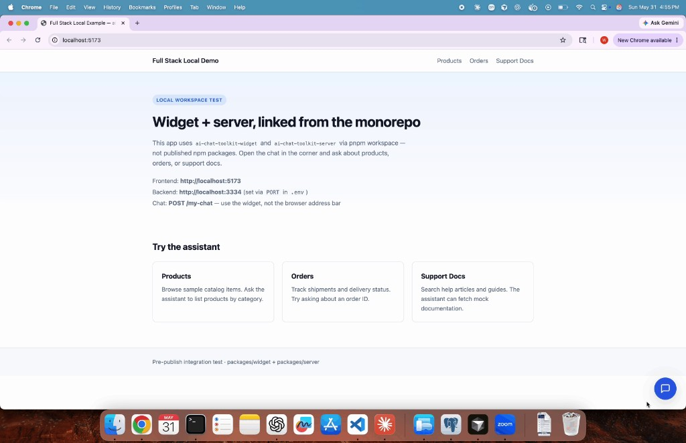

# ai-chat-toolkit

Open-source toolkit for embedding an AI-powered chat widget in any web app, with an optional Express backend for LLM providers and tool calling.

## Packages

| Package | npm name | Description |
|---------|----------|-------------|
| Widget | `ai-chat-toolkit-widget` | Embeddable Web Component (Shadow DOM) |
| Server | `ai-chat-toolkit-server` | Express backend with LLM providers + tools |

```
Frontend App
    ↓
<ai-chat> widget  (ai-chat-toolkit-widget)
    ↓
ai-chat-toolkit-server
    ↓
LLM Provider (OpenAI, Groq, Gemini, Ollama, …)
    ↓
Registered Tools
    ↓
Your APIs / DB / Services
```

## Quick start (CDN widget)

```html
<script src="https://cdn.jsdelivr.net/npm/ai-chat-toolkit-widget/dist/widget.global.js"></script>

<ai-chat
  title="AI Assistant"
  subtitle="How can I help?"
  backend-url="http://localhost:3000"
  path="/ai-chat/custom"
></ai-chat>
```

## Quick start (Express backend)

```bash
npm install ai-chat-toolkit-server express
```

```ts
import express from "express";
import { AiChatServer } from "ai-chat-toolkit-server";

const app = express();

const aiChat = new AiChatServer({
  path: "/ai-chat/custom",
  provider: "groq",
  apiKey: process.env.API_KEY,
  model: process.env.MODEL ?? "llama-3.3-70b-versatile",
  cors: { origin: "http://localhost:5173" },
});

aiChat.attach(app);
app.listen(3000);
```

See [packages/server/README.md](./packages/server/README.md) for providers, tools, `systemPrompt`, and security notes.

## Widget install

```bash
npm install ai-chat-toolkit-widget
```

```ts
import "ai-chat-toolkit-widget";
```

See [packages/widget/README.md](./packages/widget/README.md) for attributes and CDN usage.

## Chat API contract

```
POST ${backendUrl}${path}
Content-Type: application/json
```

**Request:**

```json
{
  "message": "Hello",
  "history": [
    { "role": "user", "content": "Hi" },
    { "role": "assistant", "content": "Hello!" }
  ]
}
```

**Response:**

```json
{ "message": "Assistant reply" }
```

## Monorepo layout

```
ai-chat-toolkit/
  packages/widget/              # ai-chat-toolkit-widget
  packages/server/              # ai-chat-toolkit-server
  examples/static-html/         # CDN demo
  examples/react-consumer-example/  # React + published npm widget
  examples/full-stack-local/    # Optional: workspace widget + server (pre-publish)
```

See [examples/README.md](./examples/README.md) for which example to use.

## Full Stack Local Demo



Pre-publish integration test that runs **`ai-chat-toolkit-widget`** and **`ai-chat-toolkit-server`** from the monorepo workspace (not published npm packages).

| Layer | URL | Notes |
|-------|-----|--------|
| Frontend (Vite + React) | http://localhost:5173 | Open the chat bubble in the corner |
| Backend (Express + Groq) | http://localhost:3333 | Port from `PORT` in `.env` (e.g. `3334`) |
| Chat API | `POST /my-chat` | Use the widget — not the browser address bar |

The Vite dev server proxies `/my-chat` to the backend so you avoid CORS during local development (`backend-url` is omitted on `<ai-chat>`).

### Run it

From the monorepo root:

```bash
pnpm install
pnpm build
cp examples/full-stack-local/.env.example examples/full-stack-local/.env
# Edit .env: API_KEY and MODEL (Groq example)
pnpm --filter full-stack-local-example dev
```

### Try the assistant

Open http://localhost:5173 and use the chat widget. The demo registers mock tools:

| Topic | Example prompts |
|-------|-------------------|
| **Products** | “List products in Electronics” |
| **Orders** | “What is the status of order 1?” |
| **Support docs** | “Find support articles about login” |

Greetings and thanks (“Hi”, “thank you”) should get a direct reply without calling tools. Customize behavior in `examples/full-stack-local/server/index.ts` (`systemPrompt` and tool descriptions).

Details: [examples/full-stack-local/README.md](./examples/full-stack-local/README.md).

## Scripts

| Command | Description |
|---------|-------------|
| `pnpm build` | Build all packages |
| `pnpm clean` | Remove build artifacts |
| `pnpm dev:widget` | Watch-build widget |
| `pnpm dev:server` | Watch-build server |

## Publishing to npm

Packages are released **independently** via GitHub Actions (manual dispatch):

| Workflow | Package | npm name |
|----------|---------|----------|
| **Release ai-chat-toolkit-widget** | `packages/widget` | `ai-chat-toolkit-widget` |
| **Release ai-chat-toolkit-server** | `packages/server` | `ai-chat-toolkit-server` |

Each workflow bumps only that package, creates a prefixed git tag (`widget-v*`, `server-v*`), and publishes to npm. Requires `NPM_TOKEN` in repo secrets.

### Examples

**React consumer (published npm widget):**

```bash
cd examples/react-consumer-example
npm install
npm run dev
```

## Roadmap

- [x] Widget package
- [x] Server package with tool calling
- [ ] Streaming responses
- [ ] Gemini / Ollama tool calling
- [ ] Fastify / NestJS adapters

## License

MIT — see [LICENSE](./LICENSE).
